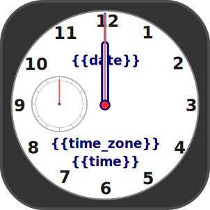
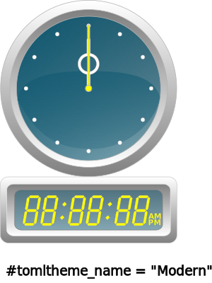
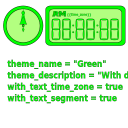

[Japanese](readme_ja.md)

# svgclock-rs

A desktop utility program that displays a clock using SVG files.

Inspired by TzClock (https://theknight.co.uk/).

# Features

-  Displays the current time using SVG files created with Inkscape.
- Can display clocks in the following 7 designs. (Ver 0.2.0)
    - Classic Design
        - 
        - 
    - Simple Square Design
		- 
        - 
    - Modern design (includes digital display)
        -  
	- Cool design (translucent)
        -  
    - Small green design
        -  
	- Monochrome design
        -  
    - Beach design (Looks like a painting. Image sourced from https://min-chi.material.jp/)
        -  
- You can also use SVG files created with user-generated Inkscape (https://inkscape.org/).
- This program is written in RUST (https://www.rust-lang.org/). It uses GTK-3 (https://www.gtk.org/) as its GUI library.
	- Currently provides binaries for the following platforms (multi-platform). Future support for other platforms is under consideration.
        - Windows 11
            - Video → https://www.youtube.com/watch?v=8_VTcSsL2fU
        - Ubuntu 24.04
			- Video → https://www.youtube.com/watch?v=UmCPHFl7AOQ

# Installation

Download the latest binary from the [release page](https://github.com/zuntan/svgclock-rs/releases).

- Windows
    - Extract the downloaded zip file and run the included svgclock-rs.exe.
	- The zip file includes the GTK-3 runtime library (dll).
- Ubuntu 24.04
    - Install the downloaded deb file using the following command:
        - `sudo dpkg -i svgclock-rs_0.1.0-1_amd64.deb`
	- The deb file does not include the GTK-3 runtime. If needed, install the GTK-3 runtime package separately. (It is typically already installed in Ubuntu Desktop environments.)

# Creating Clock Designs

You can create your own clock designs using Inkscape (https://inkscape.org/).

## Explanation Using a Simple Design

Open [Simple Theme](./clock_theme_custom.svg) in Inkscape.


- This file is also included in the package.
    - For Windows: theme/clock_theme_custom.svg in the directory where you extracted the zip file
	- For Ubuntu: /usr/share/svgclock-rs/theme/clock_theme_custom.svg

When opened in Inkscape, it will appear as follows:


- The `base` layer contains the design for the “clock face”. You can freely design this.
- Layer `long_handle` contains the design for the “long hand” of the clock. You can design it freely. Position it to point at 12 o'clock.
- Layer `short_handle` contains the design for the “short hand” of the clock. You can design it freely. Position it to point at 12 o'clock.
- Layer `second_handle` contains the design for the “second hand” of the clock. You can design it freely. Position it to point at 12 o'clock.
- Layer `center_circle` contains the design for the “rotation center of the hands.” It must contain at least one circle or ellipse. The hour hand, minute hand, and second hand rotate around the center of this circle.
- Layer `center_circle` contains design settings specified as text. You can use the characters set in the text contained in this layer to specify the design name, etc. This layer is not drawn. Images are available at https://min-chi.material.jp/ or

## Applying Your Design to svgclock-rs

Run the program from the command line, specifying the THEME_CUSTOM environment variable.

- Windows (PowerShell)
```
$Env:THEME_CUSTOM = “clock_theme_custom.svg”; <PATH/TO/>svgclock-rs.exe
```

- Linux
```
THEME_CUSTOM=clock_theme_custom.svg <PATH/TO/>svgclock-rs```
```

Specify `<PATH/TO/>` as needed.

After launching the program, select `Preferences -> Theme -> [CUSTOM]` from the right-click menu to display your created design.

To lock the clock time for design verification, set the environment variable `FIX_TIME`.

- windows (PowerShell)
```
$Env:FIX_TIME=10:15:20; $Env:THEME_CUSTOM = “clock_theme_custom.svg”; <PATH/TO/>svgclock-rs.exe
```

- Linux
```
FIX_TIME=10:15:20 THEME_CUSTOM=clock_theme_custom.svg <PATH/TO/>svgclock-rs```
```

## Brief Description of SVG Files

ToDo.

## Design Creation Examples

Open the following SVG files in Inkscape for reference.

- 
- 
- 
- 
- 
 - 
- 


# Acknowledgments

I would like to thank the author of TzClock (https://theknight.co.uk/) for the inspiration.

I would like to thank the image creator at “Minchirie” (https://min-chi.material.jp/) for providing the images.


Translated with DeepL.com (free version)