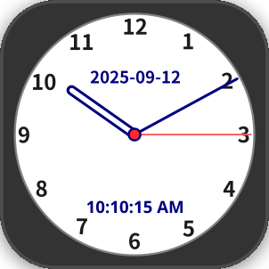
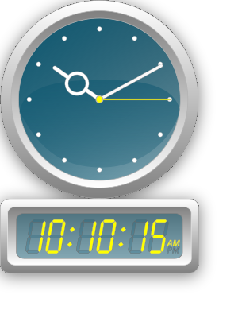
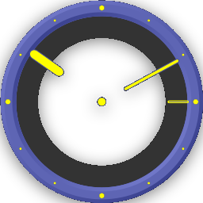
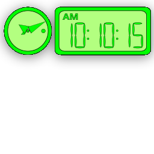
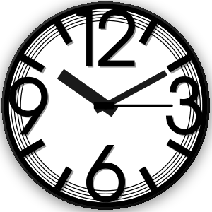
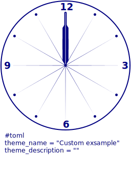
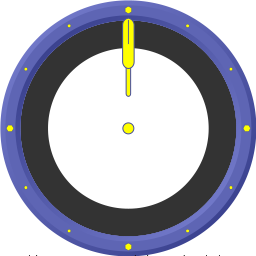
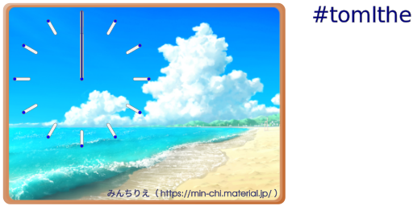

[English](readme.md)

# svgclock-rs

SVGファイルを用いて時計を表示するデスクトップユーティリティープログラムです。

TzClock ( https://theknight.co.uk/ ) にインスパイアされて作成しました。

# 特徴

-  Inkscape を用いて作成したSVGファイルを利用して、現在の時刻を表示します。
- 以下の7種類のデザインの時計を表示することができます。（Ver 0.2.0）
	- クラッシックデザイン
		- 
		- 
	- シンプルな四角いデザイン
		- 
		- 
	- モダンなデザイン（デジタル表示付きです）
		-  
	- クールなデザイン（向こう側が透けて見えます）
		-  
	- 緑の小さなデザイン
		-  
	- モノトーンのデザイン
		-  
	- 砂浜のデザイン（絵画の様です。画像は https://min-chi.material.jp/ から頂きました）
		-  
- ユーザーが作成した Inkscape (https://inkscape.org/) を用いて作成したSVGファイルを利用することもできます。
- このプログラムは RUST(  https://www.rust-lang.org/ ) で記述されています。またGUIライブラリとして、GTK-3( https://www.gtk.org/ )を用いています。
	- 現在以下のプラットフォームバイナリ提供します（マルチプラットフォーム）。将来的には他のプラットフォーム用のバイナリ提供も検討します。
		- Windows 11
			- 動画 → https://www.youtube.com/watch?v=8_VTcSsL2fU
		- Ubuntu 24.04
			- 動画 → https://www.youtube.com/watch?v=UmCPHFl7AOQ

# 導入

[リリースペちージ]( https://github.com/zuntan/svgclock-rs/releases)から最新のバイナリをダウンロードしてください。

- Windows
	- ダウンロードした zip ファイルを展開して、中に含まれる svgclock-rs.exe を起動してください。
	- zipファイルには、GTK-3用ランタイムライブラリ(dll)が含まれています。
- Ubuntu 24.04
	- ダウンロードした deb ファイルを以下のコマンドでインストールしてください。
		- `sudo dpkg -i svgclock-rs_0.1.0-1_amd64.deb`
	- deb ファイルには GTK-3用ランタイムは含まれていません。必要であれば別途GTK-3用ランタイムのパッケージをインストールしてください。( Ubuntu Desctop環境であれば通常は導入済みです。)

# 時計デザインの作成

Inkscape (https://inkscape.org/) を用いて、自分で時計のデザインを作成することができます。

## シンプルなデザインを用いた説明

[テーマシンプル](./clock_theme_custom.svg)を、Inkscapeで開いてください。


- このファイルは、パッケージにも含まれます。
	- windows の場合は、zipファイルを展開したディレクトリの下のtheme/clock_theme_custome.svg
	- ubuntu の場合は、/usr/share/svgclock-rs/theme/clock_theme_custom.svg

Inkspace で開くと、以下のように表示されます。


- レイヤー `base` には「時計の文字盤」のデザインが含まれます。自由にデザインすることができます。
- レイヤー `long_handle` には「時計の長針」のデザインが含まれます。自由にデザインすることができます。１２時を指すようにします。
- レイヤー `short_handle` には「時計の短針」のデザインが含まれます。自由にデザインすることができます。１２時を指すようにします。
- レイヤー `second_handle` には「時計の秒針」のデザインが含まれます。自由にデザインすることができます。１２時を指すようにします。
- レイヤー `center_circle` には「針の回転中心」のデザインが含まれます。必ず一つの円または楕円を含む必要があります。長針、短針、秒針は、この円の中心を基準に回転します。
- レイヤー `center_circle` にはデザインの設定が文字で含まれます。この¥レイヤに含まれるテキストに設定される文字を用いて、デザインの名前などを指定することができます。このレイヤーは描画されません。画像は https://min-chi.material.jp/ か

## 作成したデザインをsvgclock-rsに適用する


コマンドラインから環境変数 THEME_CUSTOM を指定してプログラムを実行します。

- windows (PowerShell)
```
$Env:THEME_CUSTOM = "clock_theme_custom.svg"; <PATH/TO/>svgclock-rs.exe
```

- linux
```
THEME_CUSTOM=clock_theme_custom.svg <PATH/TO/>svgclock-rs```
```

`<PATH/TO/>`の部分は必要に合わせて指定してください。

プログラムが起動したら、右クリックメニュから、`Preferences -> Theme -> [CUSTOM]` を選択しすると、作成したデザインが表示されます。

また時計の時刻を固定してデザインを確認したい場合は、環境変数 `FIX_TIME`を指定します。

- windows (PowerShell)
```
$Env:FIX_TIME=10:15:20; $Env:THEME_CUSTOM = "clock_theme_custom.svg"; <PATH/TO/>svgclock-rs.exe
```

- linux
```
FIX_TIME=10:15:20 THEME_CUSTOM=clock_theme_custom.svg <PATH/TO/>svgclock-rs```
```

## SVG ファイルの細い説明

ToDo.

## デザインの作成例

以下の SVG ファイルをInkscapeで開いて参考にしてください。

- 
- 
- 
- 
- 
- 
- 


# 謝辞

インスパイアを受けた、TzClock ( https://theknight.co.uk/ )の作者に感謝します。

画像を頂いた、「みんちりえ」 https://min-chi.material.jp/ の画像作者に感謝します。
